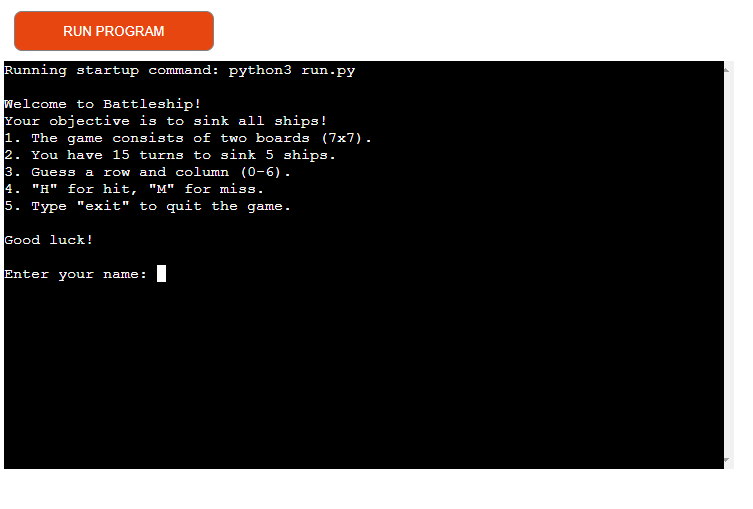
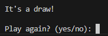

# Battleship Game

My 3rd Project for Code Institute's Diploma in Full Stack Software Development. Based of a classic board game Battleship now turn into digital form using Python.

User can run the game into the Code Institute's mock terminal on Heroku.

## ## [Live Game](https://battleshipp3-e7fcc5bb8bba.herokuapp.com/)

## How to play

1. The game consists of two boards, one for each player.

2. The boards are marked with the numbers 0 - 6.

3. You have a total of 15 turns to sink 5 hidden ships.
4. Guess a row and a column between 0 and 6.

5. If you HIT a ship, you will see 'H'.

6. If you MISS a ship, you will see 'M'.

7. Your ships are displayed as 'S'.

## Site Owner Goals 

- Use the game as part of a portfolio to show what has been learned. 

- Make sure players have a great time playing the game.

- Create features that make players want to keep using the game.

## User Stories

- Clear Instructions on how to input coordinates.

- Appealing visuality of the game so it becomes more enjoyable the game.

- Be able to see my score and computer (CPU) score. 

- Quit option in case i need to leave the game, providing flexibility in my gaming experience.

- Play again option in case want to try different strategies to win the game.

## Features

### Start screen 

- Include a welcome message and provide information about the game.

- Clearly explain how to play the game, guiding players through the rules and steps.

- Ask the player to enter their username, making them feel involved and personalizing their gaming experience.

### Game Board

  #### Battlefields

  - Set up boards for both the player and the computer for the battleship game.

  - Place ships randomly on both boards, making the game different each time.

  - Keep the computer's ships hidden, adding an element of surprise.

  - Ask the player to type in where they want to fire enemy ship.

    - First, ask them to pick a row.

    - Then, ask them to pick a column.

### The Game Score

- Keep track of whether the player or the computer successfully hit a ship or missed.

- Show the scores to let players know how well they are doing in the game.

- After each move, update the game boards to reflect the choices made by the player or the computer, making the progress visible.

### Input validation

- Player cannot guess a coordinate twice or outside the board

### End of the Game

- Declare the winner of the game by making an announcement.

- Show the final scores so the player knows how they did.

- Check if the player wants to play again.

  - If they say yes, restart the game for another round.

  - If they say no, thank them for playing the game.
  

### Future Features

- Adding color and sounds to the game so that it turns more appealing and dynamic.

- Allow players to change the size of the game board, types of ships, or how hard the game is.

- Think about letting players play against their friends or other people online for more fun.

## Technologies Used

- Languages: 
  - Python

- Platform: 
  - Heroku

## Data Model  

A class named Game is created to represent the game board and manage the game's logic. Here are the key components of the data model:

### Attributes:

- `self.size`: Determines the size of the game board (set to 7 by default).

- `self.ships`: Sets the size of the ships on the board (set to 5 by default).

- `self.p_board` and `self.c_board`: Represent the game boards for the player and computer, initialized as 7x7 grids filled with empty spaces.

- `self.p_turns` and `self.c_turns`: Keep track of the remaining turns for each player (both set to 15 initially).

- `self.p_hits` and `self.c_hits`: Track the remaining number of ships for each player (both set to 5 initially).

- `self.p_hits`: Cumulative points for hitting computer ships; `self.c_hits`: Cumulative points for hitting player ships.

### Methods:

- `get_name()`: Prompts the user to input their username, ensuring it is at least 3 characters long.

- `def show_board(self, board, hide_ships=False)`: Displays the game board. For the computer's board, it hides ships to keep them secret.

- `place_ships(self, board)`: Randomly places ships on the board, avoiding overlap.

- `is_valid(self, r, c)`: Checks if the input coordinates are within the valid range of the board.

- `fire(self, board, r, c, player)`: Processes a player's or computer's shot on the board, updating it accordingly with "Hit" or "Miss" messages.

- `play(self)`: Displays comprehensive game instructions and information.

- `play(self)`: The main game loop where players take turns and outcomes are determined. It includes the logic for player and computer turns, displaying the boards, and determining the winner.

- `end_game(self, name)`: Resets game parameters for a new round, initializing new boards and turn counts.

### Execution:
The if if __name__ == "__main__": block creates an instance of the Board class and starts the game by calling the play_game() method.

## Testing 

- The game has been tested through the [PEP8](https://pep8ci.herokuapp.com/#) linter. 

## Deployment

This project was deployed using the Code Institute's mock terminal for Heroku, and the live link can be found here [The Battleship Game]

These steps were taken for the deployment:

- Create an account or log in to Heroku.

- On the dashboard, in the right corner click the button that says "New" and choose "Create New App".

- Pick a name of the app. The name has to be unique because it can't match any other name being used.

- Select your region, United States or Europe. 

- "Create App".

- On the menu at the top of the page, go to the Settings Tab.

- Scroll down to Config Vars and click "Reveal Config Vars".

- Add a new Config Var and enter PORT in the keybox and 8000 in the valuebox.

- Under Config Vars you will find Buildpacks. 

- Click "Add Buildpacks".

- Select python.

- Repeat this step but select nodejs. 

- Important to know: The python has to be picked before the nodejs, if it is not you can change the order by click and drag to correct the order. 

- Scroll back to the top of the page, to the menu and go to the Deploy Tab.

- Select GitHub as the deployment method and confirm. 

- Search for you repository name and connect that. 

- Scroll down to the bottom of the page and there you can choose if you want the deploys to be Automatic or Manually. The Manually deployed branches needs redepolying each time the repository is updated. 

- Click "View" to see the live site. 

## ## [Live Game](https://battleshipp3-e7fcc5bb8bba.herokuapp.com/)

## ## [Live site - Github](https://github.com/RicardoMor98/Project3)

## ## [Live site - Heroku](https://dashboard.heroku.com/apps/battleshipp3)

## Credits

- Code Institute lessons and projects.

- My mentor Antonio for his advice and support.

- Thanks to Elena Hanna for support during the project.

- Thanks to Dani Dudley for support during the project.